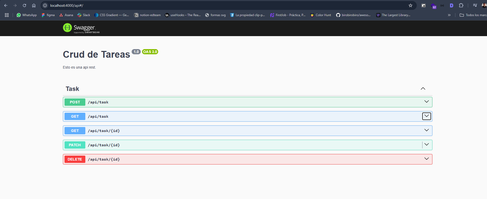

# Proyecto Next.js

Este proyecto fue creado con [Next.js](https://nextjs.org) y la plantilla `create-next-app`.

## Iniciar el Proyecto

Primero, instala las dependencias necesarias:

```bash
npm install
# o
yarn install
# o
pnpm install
```

Luego, inicia el servidor de desarrollo:

```bash
npm run dev
# o
yarn dev
# o
pnpm dev
```

Este README ahora incluye el enlace a `localhost:3000` para mayor claridad.

Extra: Se agrego una funcionalidad a nivel visual, es la eliminacion de filas a traves de los checkbox (lado del frontend). Esta funcional pero faltaria un endpoint que permita eliminar varias filas a traves de ids(lado del backend).

También se documento las apis en la parte del backend.

